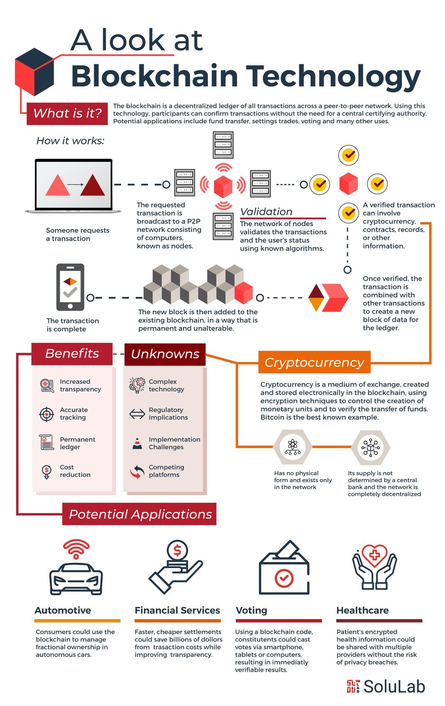
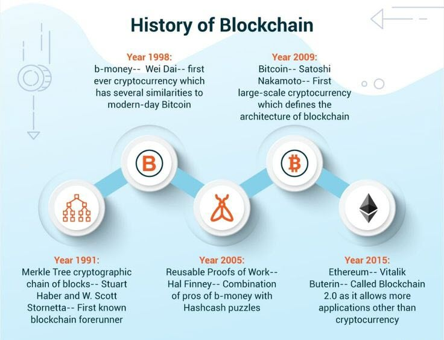
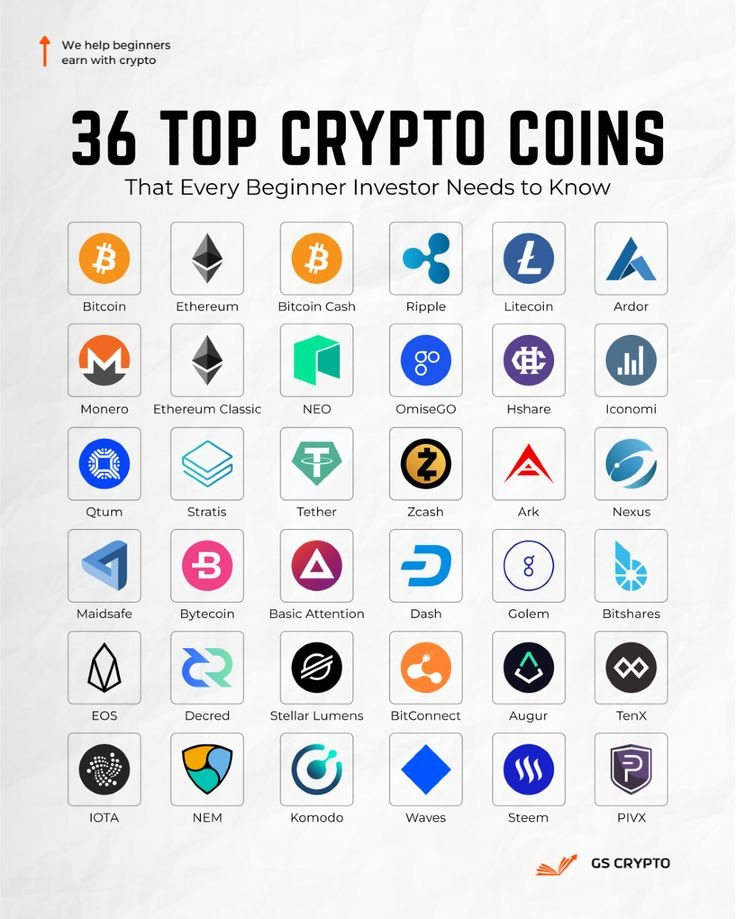
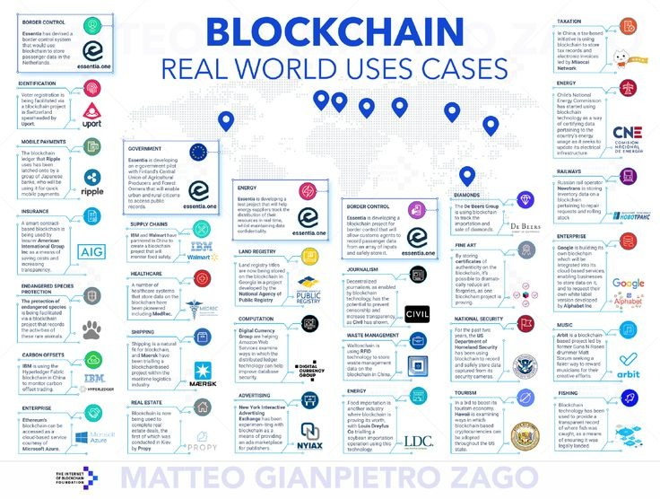
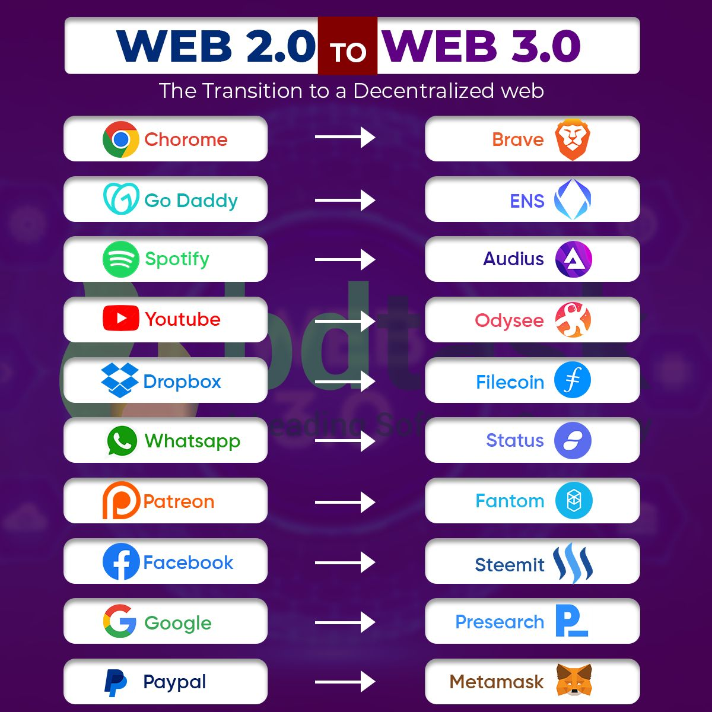

# Workshop Technology

---

# Blockchain

---

# What is it?

> Blockchain is a public ledger that records transactions in a chain of blocks, and is a way to share information transparently within a network.

---

# How does it work?

[Source](https://www.pinterest.com/pin/729723945875868579/)

---

[Source](https://www.pinterest.com/pin/1005358316800182043/)

---

# Applications

---

# Applications

[Source](https://www.pinterest.com/pin/183662491038883051/)

---

---

# Blockchain

> Digital trust

---

# Get your hands dirty

- Setup MetaMask
- Get some ETH!
  - https://cloud.google.com/application/web3/faucet/ethereum/sepolia
- Send others some eth.
- Add some LINK!
  - `0x779877A7B0D9E8603169DdbD7836e478b4624789`
